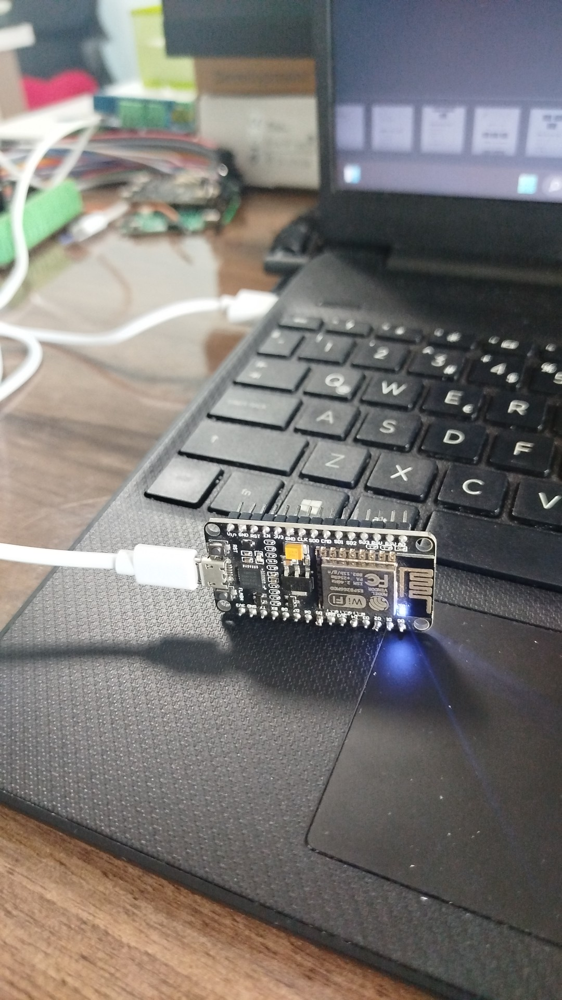
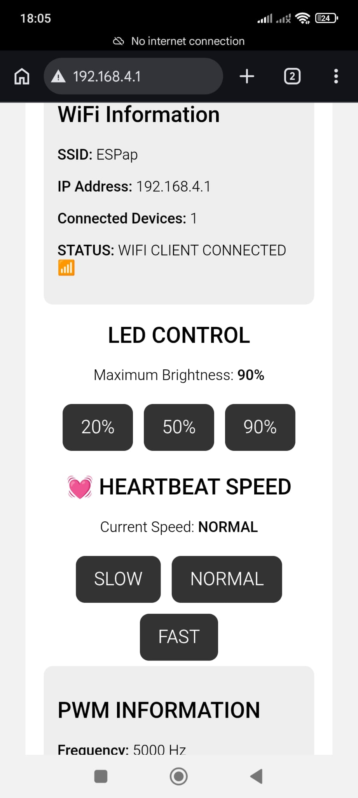
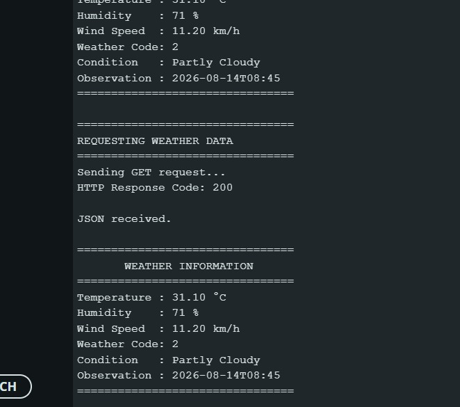

# 🌤️ ESP8266 Weather & IoT Control System

[](https://www.arduino.cc/)
[](https://www.espressif.com/en/products/socs/esp8266)
[](https://en.wikipedia.org/wiki/Wi-Fi)
[](https://en.wikipedia.org/wiki/Internet_of_things)
[](https://open-meteo.com/)

A hands-on **NodeMCU ESP8266 IoT project** combining Wi-Fi networking, a local web control panel, PWM LED control, heartbeat animation, router connectivity, HTTPS communication, JSON parsing, and live weather information from the Open-Meteo API.

The project was developed incrementally so that every subsystem could be tested and understood before being combined into a single IoT system.

---

## 🚀 Project Overview

The ESP8266 operates simultaneously as:

- a **Wi-Fi Access Point**
- a **Wi-Fi Client / Station**
- a **Web Server**
- an **HTTPS API Client**
- a **JSON parser**
- a **PWM LED controller**

The system can:

- create the `ESPap` Wi-Fi network
- connect to a home router
- host a browser-based control panel
- control LED brightness
- control heartbeat speed
- display network information
- retrieve weather data from Open-Meteo
- parse JSON weather responses
- switch between MANUAL and WEATHER control modes
- automatically adjust LED brightness according to weather conditions

---

## 🎬 Demo

### 🌐 Web Control Panel

The ESP8266 hosts a local web dashboard accessible from:

```text
http://192.168.4.1
```

The dashboard allows the user to:

- monitor Access Point information
- monitor Router / STA information
- control LED brightness
- change heartbeat speed
- view PWM parameters
- view current weather information
- switch between MANUAL and WEATHER modes

---

## 🏗️ Architecture

The system is built around a **NodeMCU ESP8266** operating simultaneously as a Wi-Fi Access Point and a Wi-Fi Client.

```text
                         INTERNET
                            │
                            ▼
                     ┌─────────────┐
                     │    ROUTER   │
                     │  Home Wi-Fi │
                     └──────┬──────┘
                            │
                        Wi-Fi / STA
                            │
                            ▼
                  ┌──────────────────────┐
                  │       ESP8266        │
                  │   NodeMCU 1.0        │
                  │                      │
                  │  Access Point        │
                  │  Wi-Fi Client        │
                  │  Web Server          │
                  │  HTTPS Client        │
                  │  ArduinoJson         │
                  │  PWM Controller      │
                  │  Heartbeat LED       │
                  └──────────┬───────────┘
                             │
                           ESPap
                             │
                             ▼
                          📱 PHONE
                     192.168.4.1
```

### Network Architecture

The ESP8266 has two network roles:

```text
AP side

ESP8266
   │
   └── ESPap
         │
         └── Phone
              IP: 192.168.4.x

AP Gateway / ESP8266 AP IP:
192.168.4.1
```

and:

```text
STA side

ESP8266
   │
   └── Home Router
         │
         └── Internet

Example STA IP:
192.168.1.xxx
```

The two interfaces belong to the same ESP8266 but serve different purposes.

### Data Flow

```text
PHONE
  │
  │ HTTP
  ▼
ESP8266 WEB SERVER
  │
  ├── Brightness control
  ├── Heartbeat speed
  ├── MANUAL / WEATHER mode
  └── Network monitoring


ESP8266 STA
  │
  │ HTTPS GET
  ▼
OPEN-METEO API
  │
  │ JSON
  ▼
ARDUINOJSON
  │
  ▼
WEATHER VARIABLES
  │
  ▼
CONTROL LOGIC
  │
  ▼
PWM
  │
  ▼
HEARTBEAT LED
```

---

## 🔧 Hardware Setup

The project uses a NodeMCU ESP8266 development board connected to the computer via USB.

The ESP8266 provides Wi-Fi connectivity, PWM LED control and a heartbeat LED.



### Hardware

- **NodeMCU 1.0 (ESP-12E Module)**
- USB cable
- Computer
- Wi-Fi router
- Built-in NodeMCU LED
- Optional external LED and resistor for future expansion
  
### Development Environment

- Arduino IDE
- ESP8266 board support
- ArduinoJson library

### Board Selection

In Arduino IDE:

```text
Tools
→ Board
→ ESP8266 Boards
→ NodeMCU 1.0 (ESP-12E Module)
```

### Serial Monitor

The project uses:

```text
115200 baud
```

for debugging and network/weather information.

---

## ⚡ PWM and LED Control

The LED is controlled using **PWM (Pulse Width Modulation)**.

Configuration:

```text
PWM Frequency  = 5000 Hz
Resolution     = 10-bit
PWM Range      = 0–1023
```

### Duty Cycle

Duty cycle describes the percentage of one PWM period during which the output is active.

Examples:

```text
0%   → fully off
25%  → low average output
50%  → medium average output
75%  → high average output
100% → maximum output
```

For a 10-bit PWM range:

```text
0
1
2
...
1023
```

The user-facing brightness percentage is mapped onto this range.

The built-in NodeMCU LED is typically **active-low**, so the software inverts the PWM value before writing it to the pin.

---

## 💓 Heartbeat LED

The LED does not simply switch between ON and OFF.

Instead, the brightness gradually changes:

```text
10 → maximum → 10
```

twice:

```text
💓  💓  ........  💓  💓
```

The heartbeat timing is controlled through:

```text
FADE_DELAY
HEART_DELAY
BEAT_PAUSE
```

### Heartbeat Profiles

```text
SLOW
FADE_DELAY = 20 ms
HEART_DELAY = 150 ms
BEAT_PAUSE = 1000 ms


NORMAL
FADE_DELAY = 10 ms
HEART_DELAY = 100 ms
BEAT_PAUSE = 600 ms


FAST
FADE_DELAY = 5 ms
HEART_DELAY = 50 ms
BEAT_PAUSE = 250 ms
```

PWM frequency and heartbeat speed are different concepts:

```text
PWM frequency
→ electrical PWM switching rate

Heartbeat speed
→ visible brightness animation rate
```

---

## 🌐 Web Dashboard



The ESP8266 runs an HTTP server on:

```text
Port 80
```

The main page is:

```text
/
```

### Brightness Control

The web page provides:

```text
20%
50%
90%
```

The requests are:

```text
/set?brightness=20
/set?brightness=50
/set?brightness=90
```

### Heartbeat Control

The heartbeat speed can be changed with:

```text
/speed?value=SLOW
/speed?value=NORMAL
/speed?value=FAST
```

### Control Mode

The system supports:

```text
MANUAL
WEATHER
```

Manual brightness requests use:

```text
/mode?value=MANUAL
```

Weather-based mode uses:

```text
/mode?value=WEATHER
```

### Wi-Fi Client Detection

The number of phones/devices connected to the ESP8266 Access Point is read using:

```cpp
WiFi.softAPgetStationNum();
```

The current prototype uses this information to limit LED brightness:

```text
0 connected clients
→ maximum 20%

1 or more connected clients
→ selected brightness
```

---

## 📶 Wi-Fi Networking

The ESP8266 uses:

```cpp
WiFi.mode(WIFI_AP_STA);
```

This enables simultaneous:

```text
AP = Access Point
STA = Station / Wi-Fi Client
```

### Access Point

Example:

```text
SSID: ESPap
Password: thereisnospoon
IP: 192.168.4.1
```

The phone can connect directly to the ESP8266.

### Station / Router

The ESP8266 also connects to a normal Wi-Fi router using:

```cpp
WiFi.begin(ROUTER_SSID, ROUTER_PASSWORD);
```

The router assigns the ESP8266 an STA IP through DHCP.

Example:

```text
STA IP: 192.168.1.xxx
```

### Connection Monitoring

The STA connection is checked with:

```cpp
WiFi.status() == WL_CONNECTED
```

The signal strength can be inspected using:

```cpp
WiFi.RSSI()
```

The router gateway can be read using:

```cpp
WiFi.gatewayIP()
```

---

## 🌤️ Weather API

The project uses the **Open-Meteo Weather Forecast API**:

https://open-meteo.com/en/docs

The API provides current weather variables such as:

- temperature at 2 m
- relative humidity at 2 m
- wind speed at 10 m
- weather code



### Example Request

```text
https://api.open-meteo.com/v1/forecast
?latitude=36.8120
&longitude=34.6410
&current=temperature_2m,relative_humidity_2m,wind_speed_10m,weather_code
```

The coordinates can be changed to another location.

### Example Response

```json
{
  "current": {
    "time": "2026-08-14T08:30",
    "temperature_2m": 30.9,
    "relative_humidity_2m": 72,
    "wind_speed_10m": 10.8,
    "weather_code": 2
  }
}
```

---

## 🔐 HTTPS Communication

Because the weather API uses HTTPS, the ESP8266 uses:

```cpp
WiFiClientSecure
```

The HTTP request is performed using:

```cpp
HTTPClient
```

Conceptually:

```text
ESP8266
   │
   │ HTTPS GET
   ▼
Open-Meteo
   │
   │ HTTPS response
   ▼
ESP8266
```

The project validates the HTTP response code.

A successful request produced:

```text
HTTP Response Code: 200
```

### Development Note

During the learning/test stage, the project used:

```cpp
client.setInsecure();
```

This disables TLS certificate verification.

This is acceptable for the current prototype/testing stage, but a production implementation should perform proper certificate validation.

---

## 🧩 JSON Parsing with ArduinoJson

The raw API response is JSON.

The project uses ArduinoJson to parse it:

```cpp
DynamicJsonDocument doc(2048);

DeserializationError error =
    deserializeJson(doc, payload);
```

The `current` object is then accessed:

```cpp
JsonObject current = doc["current"];
```

The required values are extracted:

```cpp
float temperature =
    current["temperature_2m"];

int humidity =
    current["relative_humidity_2m"];

float windSpeed =
    current["wind_speed_10m"];

int weatherCode =
    current["weather_code"];
```

The project also reads:

```text
current.time
```

for the observation timestamp.

ArduinoJson documentation:

https://arduinojson.org/

---

## 🌦️ Weather Codes

The project maps weather codes into readable descriptions.

Prototype mapping:

```text
0       Clear Sky
1       Mainly Clear
2       Partly Cloudy
3       Overcast

45/48   Fog

51-55   Drizzle

61-65   Rain

71-75   Snow

80-82   Rain Showers

95      Thunderstorm

96/99   Thunderstorm with Hail
```

For example:

```text
weather_code = 2
```

is displayed as:

```text
Partly Cloudy
```

The official Open-Meteo documentation should be used as the authoritative reference for the weather-code list:

https://open-meteo.com/en/docs

---

## 🔄 Weather Update System

The project deliberately separates web-page refresh from external API requests.

### Web Page

The browser refreshes approximately every:

```text
2 seconds
```

### Weather API

The external weather data is refreshed approximately every:

```text
60 seconds
```

This prevents the browser refresh rate from causing unnecessary external API requests.

The latest weather data is stored in ESP8266 memory and reused by the web dashboard.

---

## 🌡️ Weather Information

The web dashboard displays:

```text
Temperature
Humidity
Wind Speed
Condition
Weather Code
Observation Time
```

Example:

```text
Temperature : 30.9 °C
Humidity    : 72 %
Wind Speed  : 10.8 km/h
Weather Code: 2
Condition   : Partly Cloudy
Observation : 2026-08-14T08:30
```

---

## 🤖 MANUAL vs WEATHER Mode

The system supports two brightness-control modes.

### MANUAL Mode

The user chooses:

```text
20%
50%
90%
```

The selected value becomes the heartbeat's maximum brightness.

### WEATHER Mode

The ESP8266 uses the weather code to determine the maximum heartbeat brightness automatically.

Prototype mapping:

| Weather condition | Maximum brightness |
|---|---:|
| Clear Sky | 90% |
| Mainly Clear | 80% |
| Partly Cloudy | 70% |
| Overcast | 50% |
| Fog | 40% |
| Drizzle | 40% |
| Rain | 30% |
| Snow | 40% |
| Rain Showers | 30% |
| Thunderstorm | 20% |

The decision chain is:

```text
Weather API
    ↓
JSON
    ↓
weather_code
    ↓
Decision logic
    ↓
Maximum brightness
    ↓
Heartbeat
    ↓
PWM
    ↓
LED
```

Pressing a manual brightness button switches the controller back to MANUAL mode.

---

## ✅ Results

The project successfully demonstrated:

```text
✓ ESP8266 Access Point
✓ Phone connection to ESPap
✓ Local web server
✓ Web-based LED brightness control
✓ Web-based heartbeat speed control
✓ AP client detection
✓ Router / STA connection
✓ STA IP detection
✓ RSSI monitoring
✓ Internet access through router
✓ HTTPS weather API request
✓ HTTP 200 response
✓ JSON parsing with ArduinoJson
✓ Weather information on Serial Monitor
✓ Weather information on Web Dashboard
✓ MANUAL / WEATHER control modes
✓ Weather-based LED brightness
```

### Example Serial Monitor

```text
================================
ROUTER CONNECTED
================================

STA IP: 192.168.1.xxx
RSSI: -xx dBm

================================
WEATHER INFORMATION
================================

Temperature : 30.9 °C
Humidity    : 72 %
Wind Speed  : 10.8 km/h
Weather Code: 2
Condition   : Partly Cloudy
Observation : 2026-08-14T08:30
```

---

## 🧪 Testing Procedure

Recommended test order:

1. Select **NodeMCU 1.0 (ESP-12E Module)**.
2. Upload the sketch.
3. Open Serial Monitor at **115200 baud**.
4. Confirm `ESPap` appears on the phone.
5. Connect the phone to `ESPap`.
6. Open `http://192.168.4.1`.
7. Test 20%, 50% and 90% brightness.
8. Test SLOW, NORMAL and FAST heartbeat.
9. Confirm router / STA connection.
10. Confirm the STA IP.
11. Confirm Internet access.
12. Confirm Open-Meteo returns HTTP 200.
13. Confirm JSON parsing.
14. Confirm weather data on the dashboard.
15. Test MANUAL mode.
16. Test WEATHER mode.

---

## 🐛 Troubleshooting

### `ESPap` does not appear

Check:

- ESP8266 is powered
- `WiFi.softAP()` is being called
- the selected board is `NodeMCU 1.0 (ESP-12E Module)`
- the phone's Wi-Fi is enabled

### The web page disappears when the phone disconnects

This is expected.

The phone must be connected to `ESPap` to reach:

```text
192.168.4.1
```

The ESP8266 itself can continue running after the phone disconnects.

### Router connection fails

Check:

- router SSID
- router password
- router availability
- 2.4 GHz Wi-Fi compatibility

### Weather request fails

Check:

- STA connection
- Internet access
- API URL
- HTTP response code
- HTTPS/TLS configuration

### JSON parsing fails

Check:

- API response
- ArduinoJson installation
- requested JSON fields
- document memory capacity

---

## 🔒 Security Notes

Do **not** commit real Wi-Fi passwords or other secrets to GitHub.

Use placeholders:

```cpp
const char* ROUTER_SSID =
    "YOUR_WIFI_NAME";

const char* ROUTER_PASSWORD =
    "YOUR_WIFI_PASSWORD";
```

Before pushing code, search the repository for:

```text
password
SSID
token
API key
secret
private key
```

If a real credential is accidentally committed, remove it from repository history and rotate the credential.

For production HTTPS systems, replace:

```cpp
client.setInsecure();
```

with appropriate certificate validation.

---

## 📁 Repository Structure

```text
ESP8266-Weather-API-IoT/
│
├── README.md
├── GITHUB_PUBLISHING_NOTES.md
│
├── docs/
│   ├── 01-project-overview.md
│   ├── 02-wifi-and-networking.md
│   ├── 03-open-meteo-api.md
│   ├── 04-https-request.md
│   ├── 05-json-parsing.md
│   ├── 06-weather-codes.md
│   ├── 07-weather-web-dashboard.md
│   ├── 08-weather-led-control.md
│   └── 09-github-media-and-screenshots.md
│
└── src/
    └── weather_api_test.ino
```

---

## 📈 Project Development Stages

The project was developed incrementally:

| Stage | Feature | Status |
|---|---|---|
| 1 | PWM LED heartbeat | ✅ |
| 2 | Access Point + Web Server | ✅ |
| 3 | Web brightness control + network information | ✅ |
| 4 | Web heartbeat speed control | ✅ |
| 5 | AP + STA router connection | ✅ |
| 6 | Open-Meteo API connection | ✅ |
| 7 | HTTPS + JSON parsing | ✅ |
| 8 | Weather data on web dashboard | ✅ |
| 9 | Weather-based automatic brightness | ✅ |

This staged approach made it possible to verify each subsystem before integration.

---

## 🚀 Future Improvements

Possible future development:

- Replace blocking `delay()` calls with a fully non-blocking `millis()`-based scheduler.
- Improve automatic router reconnection.
- Add forecast data.
- Add configurable location through the web dashboard.
- Add real-time weather updates without full page reloads.
- Add charts and historical weather information.
- Add RGB LED support.
- Create weather-dependent LED color effects.
- Add authenticated web controls.
- Add proper TLS certificate validation.
- Add external sensors.
- Add data logging.
- Add MQTT support.
- Add a mobile-friendly responsive interface.
- Add OTA firmware updates.

---

## 📚 Documentation

Detailed technical explanations are available in the `docs/` directory:

```text
docs/
├── 01-project-overview.md
├── 02-wifi-and-networking.md
├── 03-open-meteo-api.md
├── 04-https-request.md
├── 05-json-parsing.md
├── 06-weather-codes.md
├── 07-weather-web-dashboard.md
├── 08-weather-led-control.md
└── 09-github-media-and-screenshots.md
```

---

## 🙏 Project Philosophy

The project was intentionally developed one subsystem at a time.

The goal was not only to make the device work, but to understand:

```text
Hardware
   ↓
PWM
   ↓
Embedded Software
   ↓
Wi-Fi
   ↓
Web Server
   ↓
Internet
   ↓
HTTPS
   ↓
REST API
   ↓
JSON
   ↓
Decision Logic
   ↓
Physical Output
```

This makes the project a practical introduction to **embedded systems, networking, IoT, APIs, and web-controlled hardware**.
